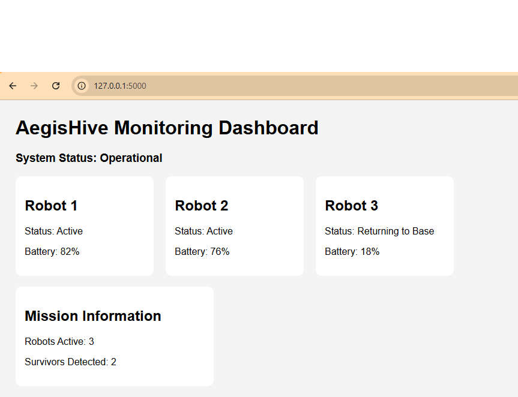
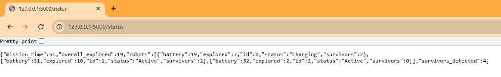
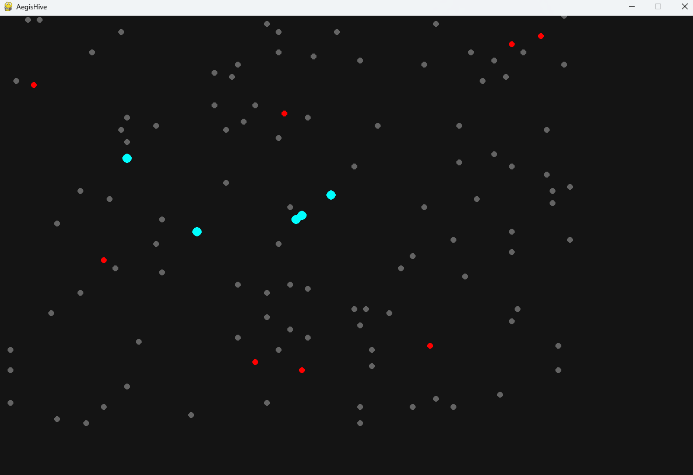
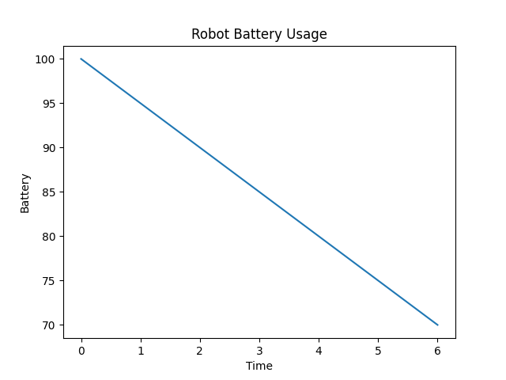

# AegisHive: Swarm Robotics System for Disaster Response

AegisHive is a programming-based simulation project that explores how multiple robots can work together in disaster response scenarios such as search and rescue operations.

I had learnt the fundamentals of robotics and hence wanted to apply them in practice. I have always wanted to build robots and systems that can be helpful to the society. So, I wanted to build a simulation system which models how robotic systems coordinate and respond in emergency situations. Since I did not have access to hardware, I built my entire project using software.

I used my basic ideas of programming, machine learning, and IoT to simulate how a real-life robotic swarm might behave in emergency situations. I built this project with the idea that the behaviour of robotic swarms must be first simulated to predict how they will behave and to correct them if there are any errors, so that they do not make mistakes in a real-life scenario. This is a very simple project that focuses on cooperation between robots, simple decision-making, and basic system monitoring.

The primary motive of my project is to understand how different components of a robotic system can be integrated together to form a good swarm and to try to simulate the ideal version of real-life swarm robots as a blueprint before building them.

---

## What the project does

- Simulates multiple robots operating in a shared environment  
- Uses a simple machine learning model to identify survivor-like conditions  
- Simulates communication between robots using MQTT concepts  
- Provides a web-based dashboard to monitor system activity  
- Generates basic analytics for system behavior  

---

## Tools and technologies used

- Python  
- Pygame (simulation)  
- Flask (web dashboard)  
- Pandas & Scikit-learn (machine learning)  
- Matplotlib (data visualization)  
- Paho MQTT (communication simulation)  

---


## How to run the project

First install dependencies:

```bash
pip install -r requirements.txt
```
Then run the system in this order:

```bash
python train_model.py
python dashboard.py
python main.py
```

## Project Screenshots

### GitHub Repository


### README Overview


### Project Folder Structure


### Machine Learning Training


### Dashboard


### Status API


### Swarm Robot Simulation


### Analytics - Battery Monitoring
